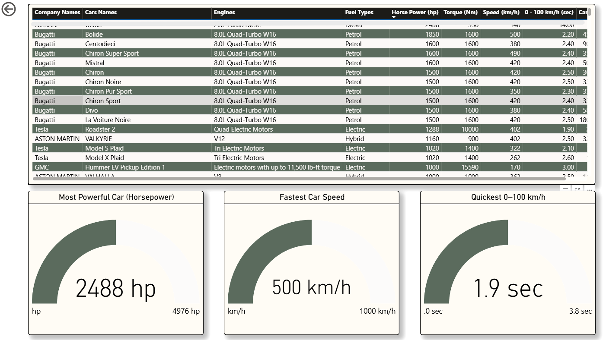

# 🚗 Car Specs Analytics Dashboard

[Dashboard Preview](1.png)

## 📊 Project Summary

This project began as a spontaneous exploration on [Kaggle](https://www.kaggle.com/datasets/abdulmalik1518/cars-datasets-2025) where I stumbled upon a **car specifications dataset** by Abdul Malik. While the dataset was rich and intriguing, it came with its fair share of inconsistencies and dirty records.

Being passionate about both data and automobiles, I decided to clean the dataset — and what began as a simple exercise quickly turned into a full-blown analytics project!

---

## 🧽 Data Cleaning Journey

Initially, the raw dataset had:
- Inconsistent data formats
- Missing and null values
- Redundant columns
- Mixed units and unstructured values

I cleaned and enhanced the data using:
- **Python and Excel** for initial inspection
- **Power Query in Power BI** for transformations
- **SQL** for structured exploration and insights (see `CarSpecDashboard.sql`)

---

## 🔍 Data Exploration (SQL)

The cleaned dataset was imported into MySQL where I explored it using various SQL queries including:

- Brand-wise car count and average price
- Fuel type distribution
- Top speed and acceleration categories
- Horsepower-to-dollar value analysis
- Horsepower vs. Torque ratios
- Acceleration class segmentation
- Engine capacity analysis

➡️ Full SQL script: [`CarSpecDashboard.sql`](CarSpecDashboard.sql)

---

## 📊 The Dashboard

The cleaned and enriched dataset was finally visualized using **Power BI**, where I brought together performance metrics, price insights, engine and fuel trends.

### Key Visuals:
- 💸 **Avg Price by Car Model**
- 💪 **Avg Horsepower by Brand**
- 🛠 **Avg Torque by Engine**
- ⚡ **Horsepower vs Speed Scatter Plot**
- 🛢 **Fuel Type Distribution Tree Map**
- 📈 **Performance Gauges: Fastest, Most Powerful, Quickest**

### Dashboard Preview

  

---

## 📁 Files in This Repo

| File | Description |
|------|-------------|
| [`Cars.csv`](Cars.csv)| Cleaned dataset |
| [`CarSpecDashboard.sql`](CarSpecDashboard.sql) | SQL queries for data analysis |
| `Car Spec Intelligence Dashboard.pbix` | Power BI dashboard file |
| `1.png`, `2.png` | Screenshots of dashboard visualizations |

---

## 🎯 Business Problem

In today's high-performance car market, manufacturers and consumers alike need deep insights into:
- Value-for-performance analysis (e.g., HP per $)
- Optimal fuel/engine configurations
- Market segment pricing (luxury vs mid-range)
- Speed vs. safety/performance trade-offs

This dashboard helps answer:  
> "Which cars and brands offer the best blend of performance, price, and engine efficiency?"

---

## 💡 Key Insights

- **Bugatti** leads both in horsepower and top speed.
- **Tesla** electric motors show remarkably high torque.
- **Petrol** still dominates the fuel type distribution.
- **La Voiture Noire** is the most expensive car in the dataset.
- The **fastest car** reaches **500 km/h** with **2488 HP**.

---

## 📌 Conclusion

What began as a playful exploration turned into a deep, analytical journey. From wrangling dirty data to building a sleek dashboard — this project sharpened my skills in:
- SQL
- Data cleaning with Power Query
- Power BI visualization
- Storytelling with data

---

## 🔗 Credits

- Dataset: [Abdul Malik - Car Dataset on Kaggle](https://www.kaggle.com/datasets/abdulmalik1518/cars-datasets-2025)
- Tools used: MySQL, Power BI, Excel, Power Query

