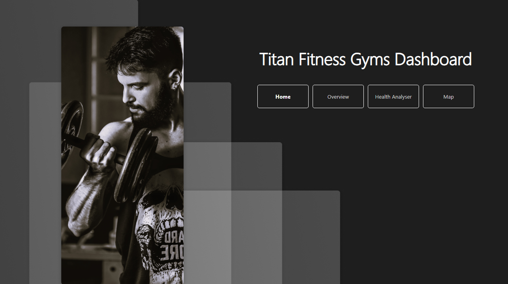
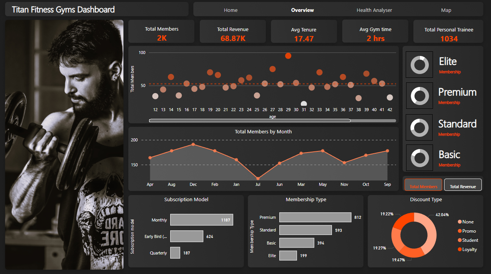
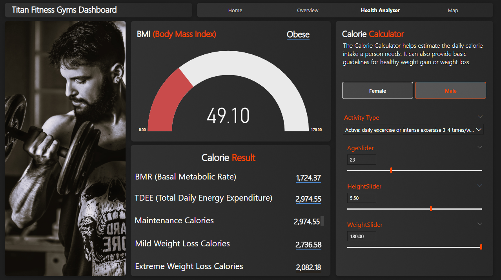
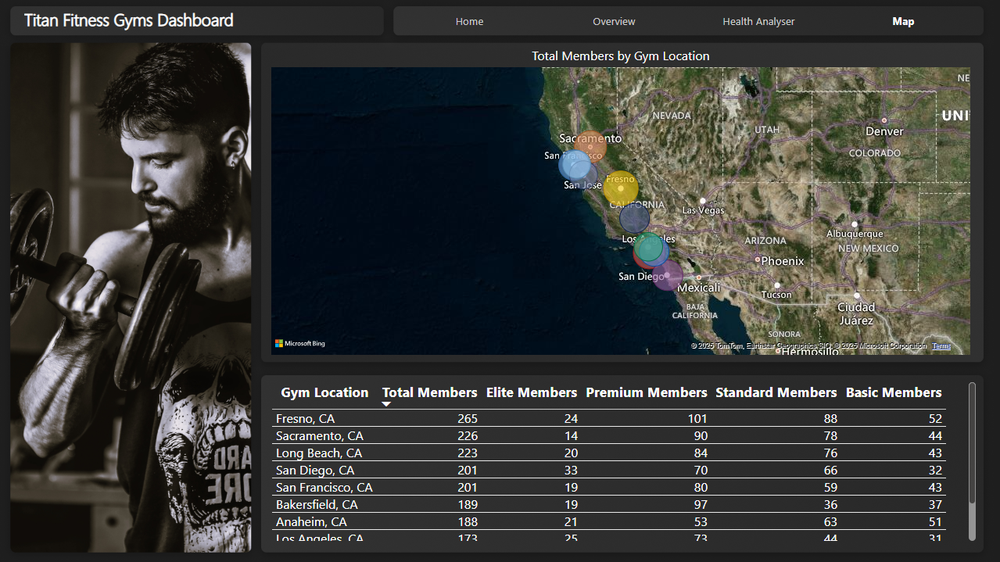

# 🏋️ Titan Fitness Gyms Analytics – Onyx Data Challenge (August 2025)

This project was created as part of the **Onyx Data Challenge (August 2025)**.  
The goal was to analyze **Titan Fitness Gyms** data and build interactive Power BI dashboards that combine **business insights** with **health analytics**.  

---

## 📂 Project Files  

- **Fitness_Membership_Analytics.pbix** → Power BI project file (main dashboard)  
- **Fitness_Membership_Analytics_Dataset.csv** → Dataset provided (1998 rows of member data)  
- **Calculator.png / Home.png / Map.png / Overview.png** → Background images used in dashboards  
- **CalculatorPic.png / HomePic.png / MapPic.png / OverviewPic.png** → Screenshots of the dashboards  
- **fit.jpg** → Asset image (gym photo used in design)  

---

## 📊 Dashboards  

### 🔹 1. **Overview Dashboard**
- KPIs: Total Members, Revenue, Avg Tenure, Avg Gym Time, Personal Training sessions.  
- Membership analysis by type (Elite, Premium, Standard, Basic).  
- Subscription models (Monthly, Early Bird, Quarterly).  
- Discounts breakdown (Promo, Student, Loyalty).  
- Member distribution by age and by month.  

### 🔹 2. **Map Dashboard**
- Total members by **gym location** (California cities).  
- Bubble map with drill-down into membership types (Elite, Premium, Standard, Basic).  
- Tabular breakdown of member counts across locations.  

### 🔹 3. **Health Analyzer (Calculator)**
- Interactive **BMI and Calorie Calculator**.  
- Calculates BMR, TDEE, and daily calorie recommendations.  
- Inputs: Gender, Age, Height, Weight, Activity Type.  
- Helps visualize **personal health goals** alongside gym usage.  

---

## 📈 Key Insights  

- **Revenue Drivers**: Premium & Elite memberships contribute significantly, especially when combined with personal training.  
- **Engagement Trends**: High-engagement users spend over 1000 minutes/month, averaging ~2 hours per session.  
- **Location Insights**: Fresno, Sacramento, and San Diego gyms have the largest memberships.  
- **Discounts & Retention**: Promo discounts account for ~42% of members, showing their importance in attracting/retaining users.  

---

## ⚙️ Tech Stack  

- **Power BI** – Dashboard design & analytics  
- **CSV Dataset** – Member data (1998 rows)  
- **Custom Images** – Backgrounds and assets for UI consistency  

---

## 📌 Challenge Reference  

This project is part of the **Onyx Data August 2025 Challenge**.  
👉 [Onyx Data Challenges](https://onyxdata.co.uk/data-dna/)  

---

## 📷 Dashboard Previews  

| Dashboard | Screenshot |  
|-----------|------------|  
| Home |  |  
| Overview |  |  
| Health Analyzer |  |  
| Map |  |  

---

## 🙌 Acknowledgments  

Thanks to **Onyx Data** for organizing these monthly challenges and providing a great platform to practice real-world data storytelling.  
